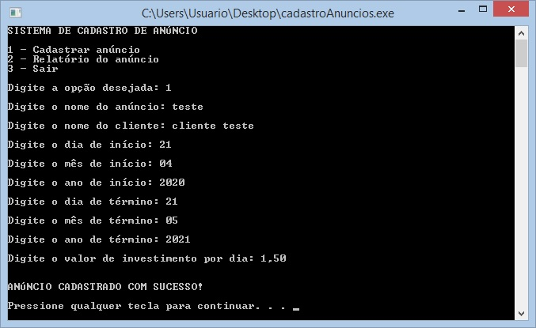
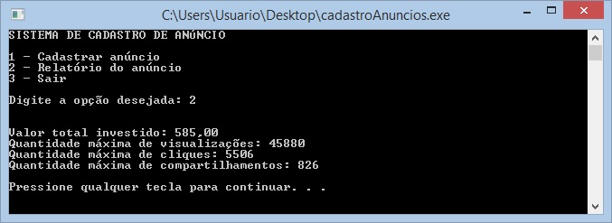
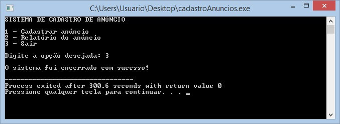

# Sistema para gerenciamento de anúncios

Sistema que permite o gerenciamento de anúncios online. Cada anúncio deverá conter os seguintes dados:

- nome do anúncio

- cliente

- data de início

- data de término

- investimento por dia

  

O sistema fornecerá o relatório do anúncio contendo:

- valor total investido

- quantidade máxima de visualizações

- quantidade máxima de cliques

- quantidade máxima de compartilhamentos

O sistema irá gerar o relatório com base nos seguintes dados:

- a cada 100 pessoas que visualizam o anúncio 12 clicam nele.

- a cada 20 pessoas que clicam no anúncio 3 compartilham nas redes sociais.

- cada compartilhamento nas redes sociais gera 40 novas visualizações.

- 30 pessoas visualizam o anúncio original (não compartilhado) a cada R$ 1,00 investido.

- o mesmo anúncio é compartilhado no máximo 4 vezes em sequência

  (1ª pessoa -> compartilha -> 2ª pessoa -> compartilha - > 3ª pessoa -> compartilha -> 4ª pessoa)

### Demonstração do programa

### Pré-requisitos

Antes de começar, você vai precisar ter instalado em sua máquina Windows as seguintes ferramentas:

- [Dev-C++](https://sourceforge.net/projects/orwelldevcpp/) (para compilar e executar o programa) 
- [Git](https://git-scm.com/) (para clonar o repositório)
- Alguma ferramenta para extração de arquivo zip (caso opte por baixar o repositório usando a opção "Download ZIP")

### Rodando o programa

1. Clone este repositório

   - com o Git:

     $ git clone https://github.com/JuuhDias94/gerenciamento-de-anuncios.git

   - ou baixe o repositório usando a opção "Download ZIP"

2. Abra o arquivo "cadastroAnuncios.c" na IDE Dev-C++

3. Clique em Compile (F9)

4. Clique em Run (F10)

### Instruções de utilização

Após executar o programa e o menu ser mostrado:

- Digite 1 para cadastrar o anúncio
- Digite 2 para gerar o relatório do anúncio
- Digite 3 para encerrar o programa

Observação: Na execução do programa, na opção 1 do menu, utilizar vírgula ao inserir valor de investimento por dia, em vez de ponto.

### Autora

Juliete Dias de Oliveira
